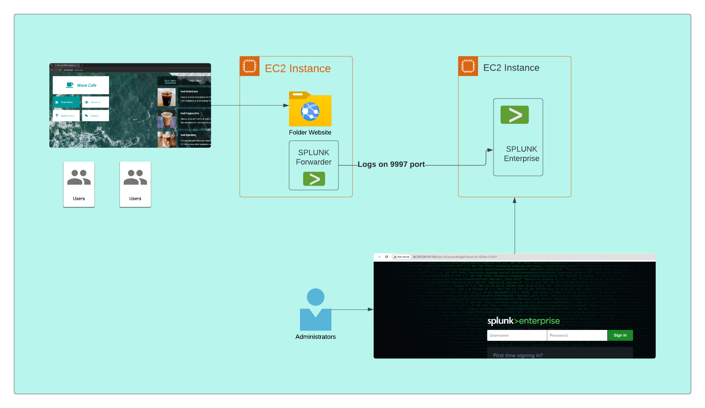

# Splunk Monitoring on RHEL EC2 for Website Logs

This project provides a step-by-step guide to set up Splunk monitoring on a Red Hat Enterprise Linux (RHEL) EC2 instance, specifically for collecting and analyzing website logs.

## Project Overview

- **Goal:** Deploy Splunk Universal Forwarder on a RHEL EC2 instance to forward website logs to a Splunk server for monitoring and analysis.
- **Use Case:** Centralized log management and real-time monitoring of website activity hosted on AWS EC2.

## Architecture



*If the image does not display, ensure `splunk_arch.png` is present in the project root. For more architecture diagrams, refer to the PDF.*

## Prerequisites

- AWS account with permissions to launch and manage EC2 instances.
- RHEL EC2 instance running and accessible.
- Splunk Enterprise or Splunk Cloud instance for receiving logs.
- SSH access to the EC2 instance.
- Website logs available on the EC2 instance (e.g., Apache, Nginx).

## Setup Steps

> **For screenshots and detailed step-by-step visuals, refer to the included PDF: `Splunk Monitoring_RHEL_EC2.pdf`.**

### 1. Prepare the EC2 Instance

- Update system packages:
  ```
  sudo yum update -y
  ```
- Ensure required ports are open (e.g., 9997 for Splunk Forwarder).

### 2. Install Splunk Universal Forwarder

- Download the Splunk Universal Forwarder RPM from [Splunk Downloads](https://www.splunk.com/en_us/download/universal-forwarder.html).
- Install the RPM:
  ```
  sudo rpm -ivh splunkforwarder-<version>-linux-2.6-x86_64.rpm
  ```
- Start and enable Splunk Forwarder:
  ```
  sudo /opt/splunkforwarder/bin/splunk start --accept-license
  sudo /opt/splunkforwarder/bin/splunk enable boot-start
  ```

### 3. Configure Forwarding

- Set up the Splunk Forwarder to send logs to your Splunk server:
  ```
  sudo /opt/splunkforwarder/bin/splunk add forward-server <splunk-server-ip>:9997
  ```
- Add website log files as inputs:
  ```
  sudo /opt/splunkforwarder/bin/splunk add monitor /var/log/httpd/access_log
  sudo /opt/splunkforwarder/bin/splunk add monitor /var/log/httpd/error_log
  ```
  *(Adjust paths for your web server and log locations.)*

### 4. Verify Data in Splunk

- Log in to your Splunk instance.
- Search for incoming data from your EC2 instance.
- Set up dashboards or alerts as needed.

## Troubleshooting

- Check Splunk Forwarder logs: `/opt/splunkforwarder/var/log/splunk/splunkd.log`
- Ensure network connectivity between EC2 and Splunk server.
- Verify log file permissions.

## References

- [Splunk Universal Forwarder Documentation](https://docs.splunk.com/Documentation/Forwarder)
- [AWS EC2 Documentation](https://docs.aws.amazon.com/ec2/)
- [RHEL Documentation](https://access.redhat.com/documentation/en-us/red_hat_enterprise_linux/)
- **Screenshots:** See `Splunk Monitoring_RHEL_EC2.pdf` in this repository.

## License

This project is provided for educational purposes. Please review and comply with all relevant licenses for Splunk and AWS services.
